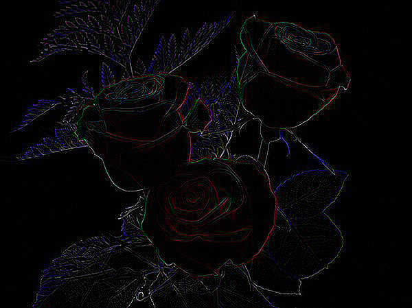

# Convolution Filter

In image processing, convolution matrix, or mask is a small matrix. It is used for blurring, sharpening, embossing, edge detection, and more.  

##### Original image

##### Identity filter
Kernel: 

| | | |
|-|-|-|
| 0 | 0 | 0 |
| 0 | 1 | 0 |
| 0 | 0 | 0 |

##### Edge detection filter
Kernel: 

| | | |
|-|-|-|
| 0 | 1 | 0 |
| 1 | -4 | 1 |
| 0 | 1 | 0 |

##### Sharpen filter
Kernel: 

| | | | | |
|-|-|-|-|-| 
| 0 | 0 | 0 | 0 | 0 |
| 0 | 0 | 5 | 0 | 0 |
| 0 | -1 | 5 | -1 | 0 |
| 0 | 0 | 1 | 0 | 0 |
| 0 | 0 | 0 | 0 | 0 |

##### Box blur filter
Normalization rate = 16

Kernel: 

| | | |
|-|-|-|
| 1 | 2 | 1 |
| 2 | 4 | 2 |
| 1 | 2 | 1 |

##### Gaussian blur filter
Normalization rate = 256

Kernel: 

| | | | | | 
|-|-|-|-|-|
| 1 | 4 | 6 | 4 | 1 |
| 4 | 16 | 24 | 16 | 4 |
| 6 | 24 | 36 | 24 | 6 |
| 4 | 16 | 24 | 16 | 4 |
| 1 | 4 | 6 | 4 | 1 |

##### Motion blur filter
Normalization rate = 9

Kernel: 

| | | | | | | | | |
|-|-|-|-|-|-|-|-|-|
| 1 | 0 | 0 | 0 | 0 | 0 | 0 | 0 | 0 |
| 0 | 1 | 0 | 0 | 0 | 0 | 0 | 0 | 0 |
| 0 | 0 | 1 | 0 | 0 | 0 | 0 | 0 | 0 |
| 0 | 0 | 0 | 1 | 0 | 0 | 0 | 0 | 0 |
| 0 | 0 | 0 | 0 | 1 | 0 | 0 | 0 | 0 |
| 0 | 0 | 0 | 0 | 0 | 1 | 0 | 0 | 0 |
| 0 | 0 | 0 | 0 | 0 | 0 | 1 | 0 | 0 |
| 0 | 0 | 0 | 0 | 0 | 0 | 0 | 1 | 0 |
| 0 | 0 | 0 | 0 | 0 | 0 | 0 | 0 | 1 |

##### Emboss(Relief) filter
Kernel: 

| | | |
|-|-|-|
| -2 | -1 | 0 |
| -1 | 1 | 1 |
| 0 | 1 | 2 |

For more information visit [this](https://docs.gimp.org/2.6/en/plug-in-convmatrix.html)